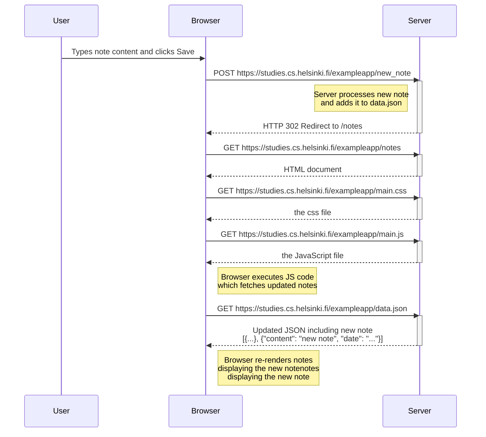

```mermaid
sequenceDiagram
participant User
participant Browser
participant Server

User->>Browser: Types note content and clicks Save
Browser->>Server: POST https://studies.cs.helsinki.fi/exampleapp/new_note
activate Server
Note left of Server: Server processes new note<br>and adds it to data.json
Server-->>Browser: HTTP 302 Redirect to /notes
deactivate Server

Browser->>Server: GET https://studies.cs.helsinki.fi/exampleapp/notes
activate Server
Server-->>Browser: HTML document
deactivate Server

Browser->>Server: GET https://studies.cs.helsinki.fi/exampleapp/main.css
activate Server
Server-->>Browser: the css file
deactivate Server

Browser->>Server: GET https://studies.cs.helsinki.fi/exampleapp/main.js
activate Server
Server-->>Browser: the JavaScript file
deactivate Server

Note right of Browser: Browser executes JS code<br>which fetches updated notes

Browser->>Server: GET https://studies.cs.helsinki.fi/exampleapp/data.json
activate Server
Server-->>Browser: Updated JSON including new note<br>[{...}, {"content": "new note", "date": "..."}]
deactivate Server

Note right of Browser: Browser re-renders notes<br>displaying the new notenotes<br>displaying the new note
```
