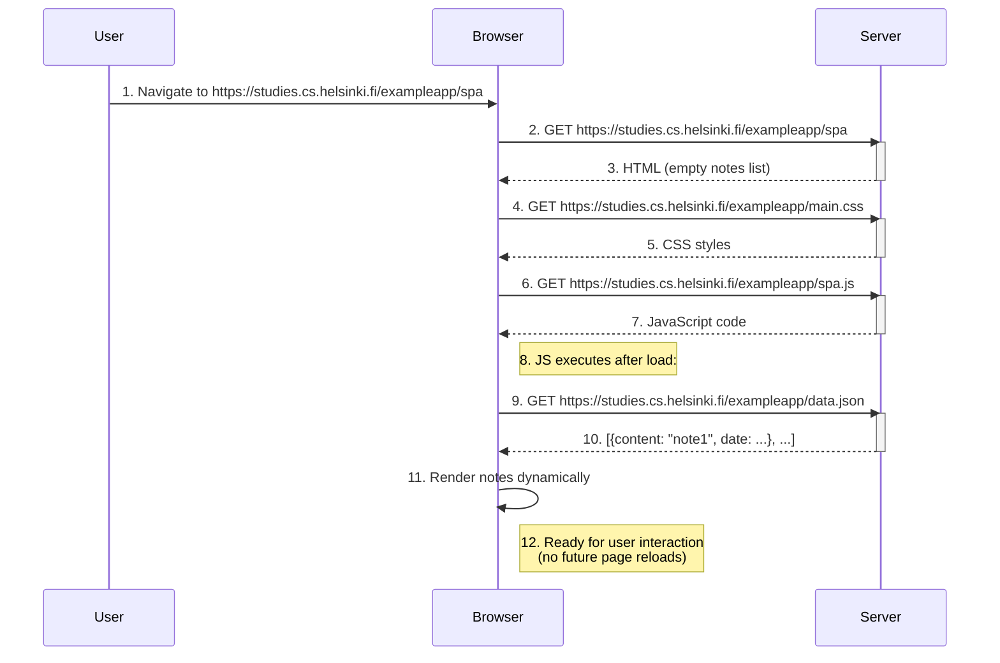

# SPA Notes App Flow Diagram



## Key SPA Characteristics

1. **Initial Load Similarities**:

   ```mermaid
   flowchart LR
       A[Initial Load] --> B[HTML]
       A --> C[CSS]
       A --> D[JavaScript]
   ```

   - Still requires base resources like traditional apps
   - HTML contains just a root container (e.g., `<div id="app"></div>`)

2. **Subsequent Interactions**:

   ```mermaid
   flowchart TD
       A[User Action] --> B[JS Event Handler]
       B --> C[API Call]
       C --> D[DOM Update]
   ```

   - Handled entirely by JavaScript
   - Communicates via JSON APIs (no HTML responses)
   - Updates specific DOM elements

3. **Data Flow**:
   ```mermaid
   flowchart LR
       Client-->|JSON Request|Server
       Server-->|JSON Response|Client
       Client-->|DOM Manipulation|UI
   ```
   - Only `data.json` fetched after initialization
   - No full page reloads ever occur
