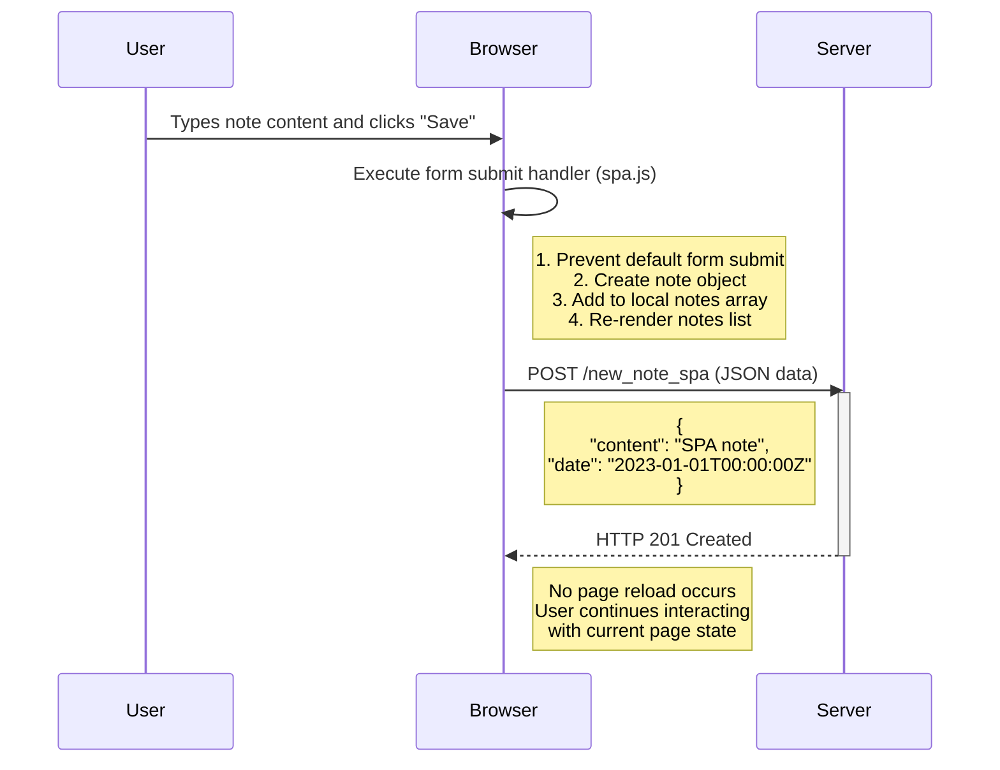

 
Sequence diagram showing the SPA (Single-Page Application) flow for creating a note: 
The browser handles form submission via JavaScript, sends data to the server as JSON, and updates the UI without reloading the page.
